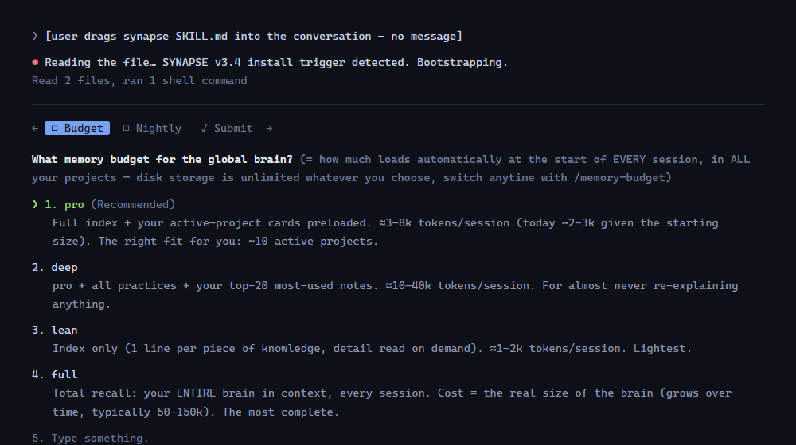
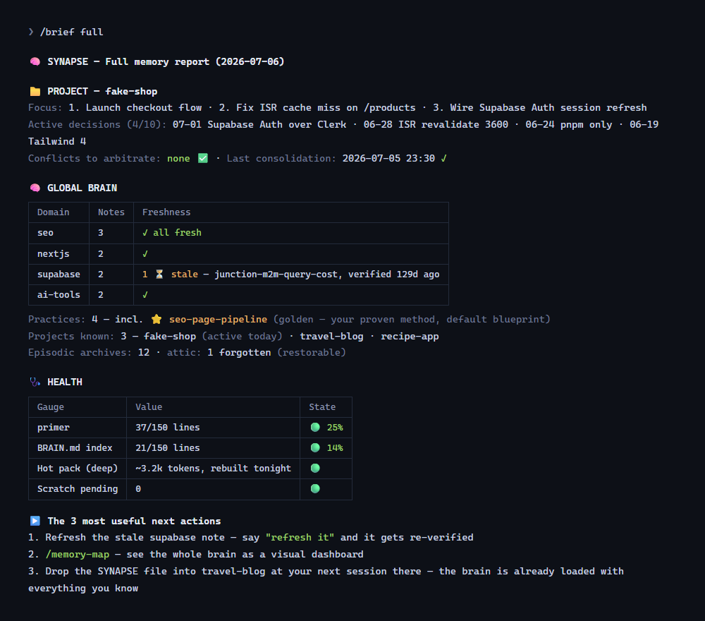
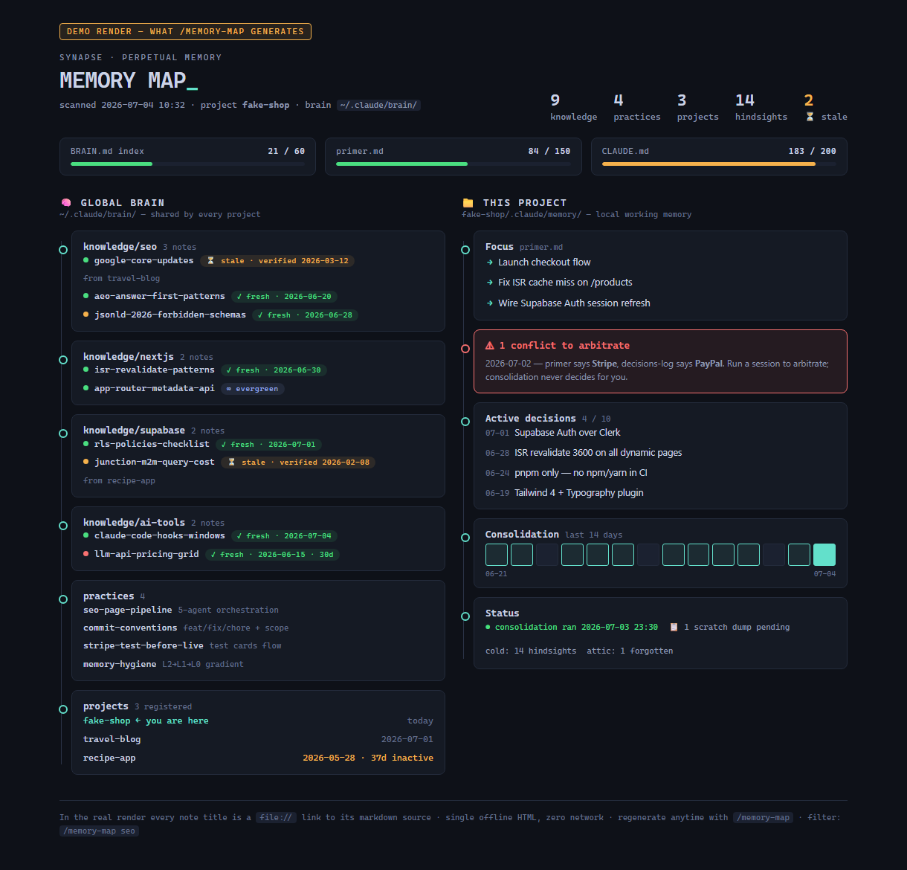

<div align="center">

# 🧠 SYNAPSE

**Perpetual memory & shared brain for Claude Code — and any AI coding agent.**

One markdown file. Zero dependencies. Drag it into a conversation, and your agent never forgets.

   

[Install](#install) · [What you get](#what-you-get) · [How it works](#how-it-works) · [The cognitive engine](#the-cognitive-engine) · [Other agents](#beyond-claude-code) · [FAQ](#faq)

</div>

---

## The problem

Every AI coding session starts from zero. Your agent forgets yesterday's decisions, re-researches what it already learned last month, contradicts choices it made last week, and repeats mistakes it already fixed in another project. Context compacts; knowledge evaporates.

## The fix

SYNAPSE is a **complete memory system in a single markdown file**. Give the file to your agent — that's the whole install. It builds:

- 📁 **Local memory** per project — working state, dated decisions, session archives
- 🧠 **Global brain** shared across ALL your projects — knowledge learned once, available everywhere
- 😴 A nightly **sleep cycle** — compresses, deduplicates, detects contradictions, promotes reusable learnings
- ⏳ **Freshness dates** — aging knowledge gets flagged for re-verification instead of silently rotting
- 🔗 **Reinforcement** — notes that actually get used grow stronger; unused ones fade. *What fires, wires.*

Everything is plain markdown on your machine. No cloud. No database. No MCP server. No telemetry. No lock-in.

## Install

### Claude Code — one gesture

Download **[`SKILL.md`](./SKILL.md)** and drag it into any Claude Code conversation. Say nothing else. Claude installs everything itself (~40 seconds) and reports back.

Or from the terminal:

```bash
mkdir -p ~/.claude/skills/synapse && curl -fsSL https://raw.githubusercontent.com/ANTHO56200/synapse-memory/main/SKILL.md -o ~/.claude/skills/synapse/SKILL.md
```

then open Claude Code in any project and say: *"set up SYNAPSE"*.

### Any other AI agent — portable mode

Give the file to Cursor, Codex CLI, Gemini CLI, Windsurf… and say: *"Read this file and set up SYNAPSE portable mode (Part 7)."*

All agents share **the same brain** — knowledge learned in Claude is available in Cursor, and vice versa.

### The installer asks you exactly two questions

1. **Your memory budget** — how much of the brain auto-loads at every session start. Four levels, each shown with the REAL token cost computed from *your* actual brain: `lean` (index only, ≈1–2k) · `pro` (+ active-project cards, ≈3–8k) · `deep` (+ all practices + your top-20 notes, ≈10–40k) · `full` (total recall — the entire brain in context, typically 50–150k once mature). Nothing is a commitment: a fresh brain costs ~2–3k at *any* level — cost only grows with what you actually store — and `/memory-budget` switches levels anytime.
2. **Nightly consolidation** — the 23:30 "sleep cycle" (cron on macOS/Linux, Task Scheduler on Windows), running headless on your existing Claude subscription (`claude -p`), no API key. The installer sanity-checks your machine's clock first: if it lives in another timezone than you do (remote workers, travelers), it schedules your *real* late evening. **Machine off that night? Nothing is lost**: consolidation always processes everything *since the last hindsight*, so the next run — scheduled or a manual `/consolidate` — catches up with zero memory gaps.

That's it. Everything else installs silently: memory auto-load, hooks, all the commands, project registration in the brain.



## What you get

| Command | What it does |
|---|---|
| `/brief` | Where were we? 5-line project status on demand |
| `/brief full` | Complete State of the Union of both memory levels |
| `/recall <topic>` | Search ALL memory across ALL projects, with freshness warnings |
| `/decision <what>` | Log a dated decision, auto-checked for contradictions |
| `/learn <insight>` | Promote reusable knowledge to the global brain |
| `/forget <topic>` | Clean removal — soft by default, restorable from the attic |
| `/memory-map` | Visual HTML dashboard of everything your agent knows |
| `/memory-budget` | Choose how much memory auto-loads per session — from a 2k-token index up to **full total recall** (your entire brain in context). Real cost shown before you choose; storage itself is unlimited |
| `/consolidate` | Run the sleep cycle right now |
| `/memory-doctor` | Memory health score /100 + auto-fixes |

Plus the automatic part: memory auto-loads at every session start, a pre-compaction hook saves state before context loss, and the session brief warns you about unarbitrated conflicts and stale knowledge.

**`/brief full` — the complete state of your memory, on demand:**



**The `/memory-map` dashboard** ([live demo](https://claude.ai/code/artifact/3e486f24-d565-401d-bdaf-27e6a9ae5251), [source](./demo/memory-map-demo.html)):



## How it works

```
~/.claude/brain/                     GLOBAL BRAIN (all projects share it)
├── BRAIN.md                         tiny index — auto-loaded every session
├── knowledge/<domain>/*.md          semantic memory (facts, research) w/ freshness
├── practices/*.md                   procedural memory (how-tos, patterns)
├── projects/                        registry + one card per project
└── episodic/*.md                    heavy archives + attic (soft-forgotten)

<project>/.claude/memory/            LOCAL MEMORY (this project only)
├── primer.md                        working memory — auto-loaded, ≤150 lines
├── warm/                            on-demand depth (architecture, decision log)
├── cold/hindsight/                  dated session archives
└── scratch/                         ephemeral (pre-compaction dumps)
```

Memory lives on a **compression gradient**, like human memory: L0 full detail → L1 one-page summary → L2 one index line. How much auto-loads per session is **your choice — the memory budget**: `lean` injects the index only (≈1–2k tokens), `pro` adds your active-project cards (≈3–8k), `deep` adds all practices + your top-20 most-used notes (≈10–40k), and `full` is **total recall** — the entire L1 brain in context, every session (typically 50–150k tokens; modern long-context models scan it, keep what today's task needs, set the rest aside). Levels ≥ pro ride in a precompiled `HOT.md` pack rebuilt nightly, and `/memory-budget` always shows the real token price of each level *for your actual brain* before you choose. Hard limits force compression so the hot context never bloats, while **storage on disk stays unlimited**. And when the index fills up with knowledge that's all fresh and actively used, SYNAPSE never silently drops anything — it flags memory pressure and asks you: raise the budget, or archive (archived entries stay on disk, still findable with `/recall`).

Every night (cron / Task Scheduler — or `/consolidate` manually), a headless consolidation pass runs on your existing subscription: it writes the day's hindsight, refreshes the primer surgically, flags contradictions (never arbitrates them — you own the truth), rotates old decisions to cold storage, promotes reusable learnings to the global brain, and re-ranks the index.

## The cognitive engine

SYNAPSE borrows the mechanisms that make biological memory work:

- **Compression gradient (L0/L1/L2)** — detail decays into summaries, summaries into index lines; nothing useful is lost, nothing bloated stays hot.
- **Sleep consolidation** — memory maintenance happens nightly, off your working sessions.
- **Hebbian reinforcement** — every note tracks `uses` / `last_used`. Knowledge that answers real questions earns its place in the index; dormant notes are eviction candidates (their files remain, greppable).
- **Spaced repetition** — a note re-verified *unchanged* doubles its `stale_after` (max 365d); a note that *changed* halves it (min 30d). The memory learns its own decay rate, like flashcards.
- **Freshness decay** — every fact carries `verified` + `stale_after`. Past due → flagged ⏳ in the session brief. An agent that says "let me re-check" beats one confidently citing March pricing in July.
- **⭐ Golden references** — mark your best work (`golden: true`): the site with your best SEO scores, the auth flow that never failed. Golden notes are never evicted, always in the hot pack, and become the default blueprint whenever you build something similar.
- **Gotcha memory** — a painful bug and its fix always become a brain note tagged `gotcha`, even if it felt project-specific. The Stripe nightmare you solved six months ago in another repo? Your agent remembers the fix — and never hits that wall again.

## Beyond Claude Code

The memory itself is agent-agnostic — plain files plus a protocol. Platform support differs only in automation depth:

| Capability | Claude Code | Other agents (portable mode) |
|---|---|---|
| Two-level memory, all formats | ✅ | ✅ same files, same brain |
| Auto-load at session start | ✅ imports | ✅ via instruction file (`AGENTS.md`, rules…) |
| Commands | ✅ slash commands | ✅ trigger phrases (`synapse brief`…) |
| Session hooks (auto-brief, pre-compaction) | ✅ | where the platform supports hooks |
| Nightly consolidation | ✅ headless (`claude -p`) | headless CLI if available, else on demand |

## Privacy

- Your memory is plain markdown **on your machine**. Nothing is sent anywhere by SYNAPSE — ever.
- **Secrets, tokens, .env values and personal identifiers are never stored** — it's a hard rule in the protocol, not a setting.
- Cross-project observation is **read-only** by design.
- The consolidation LLM runs with file tools only — **no shell access**.

## FAQ

**Where exactly is my data?** `~/.claude/brain/` (global) + `<project>/.claude/memory/` (local). Delete them and SYNAPSE is gone.

**What does it cost per session?** Your choice, price shown upfront: lean ≈1–2k tokens · pro ≈3–8k · deep ≈10–40k · **full total recall** = the real size of your entire brain (typically 50–150k). Set at install, resize anytime with `/memory-budget`. Only the auto-load is capped; what you can store is unlimited.

**Multiple machines?** Make `~/.claude/brain/` a **private** git repo — the file tells your agent how (Part 4).

**Teams?** Memory is per-human by default; the installer offers a gitignore option so teammates don't inherit yours.

**Windows?** First-class and battle-tested: hooks run through Git Bash, the scheduler uses Task Scheduler, and the installer knows the platform's traps (like `@~/` imports silently failing — it uses absolute paths instead).

**How do I uninstall?** Ask your agent to "uninstall SYNAPSE" — the file documents complete removal (Part 5), with an export offered first.

## Contributing

Issues and PRs welcome — especially portable-mode reports from other agents, and platform quirks you've verified empirically. Keep the invariants (Part 9 of the file): plain files, hard limits, flagged-not-arbitrated conflicts, no secrets.

If SYNAPSE saved your context, a ⭐ helps others find it.

## The companion library

SYNAPSE teaches your agent *to remember*. The **[Claude Skills Library](https://github.com/ANTHO56200/claude-skills-library)** teaches it *how to work* — free, MIT-licensed, token-lean skills covering security, testing, dev-workflow, AI/LLM, research and more. The two are built to work together.

## License & author

MIT © 2026 [Anthony Martinez](https://github.com/ANTHO56200) — founder, [The Planet Tools](https://theplanettools.ai).

*SYNAPSE is part of the [theplanettools.ai](https://theplanettools.ai) toolbox — tools reviewed and built for the AI-first web.*
